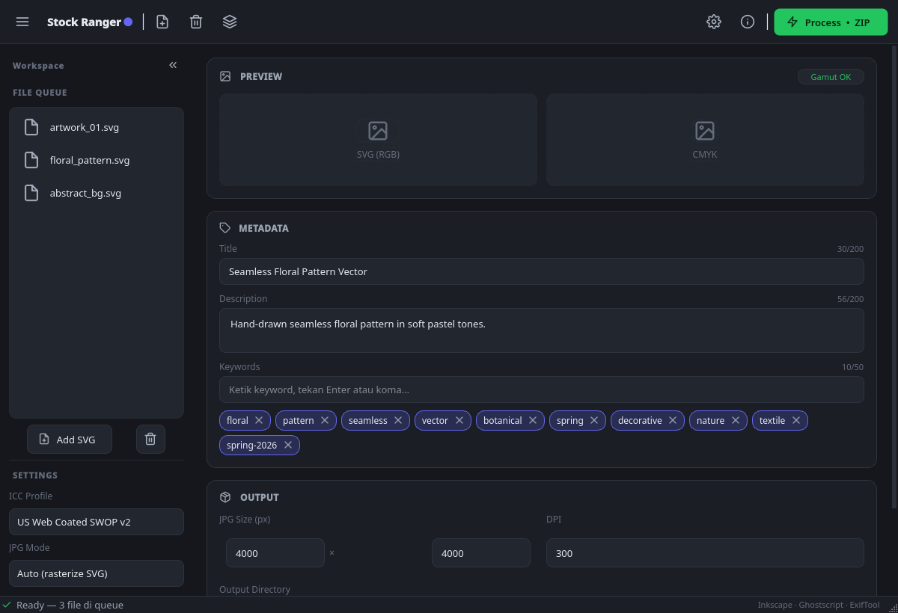

# Stock Ranger

Desktop app Linux untuk contributor microstock (fokus Shutterstock). Mengubah
file SVG dari Inkscape menjadi paket **ZIP siap upload**: EPS 10 CMYK + JPG
preview, lengkap dengan metadata XMP/IPTC ter-embed — mengisi gap yang
ditinggalkan Adobe Bridge & Xpiks di Linux.



## Pipeline

```
SVG (Inkscape)
  → validasi
  → EPS 10 CMYK   (Inkscape→PDF→Ghostscript, RGB→CMYK via ICC)
  → JPG preview   (Inkscape rasterize + Pillow)
  → embed metadata XMP/IPTC (ExifTool, ke EPS & JPG)
  → ZIP siap upload
```

Konversi warna vektor RGB→CMYK dilakukan **Ghostscript** di level device; konversi
raster pakai **LittleCMS** (`PIL.ImageCms`). Detail keputusan teknis ada di
[`poc/POC_RESULTS.md`](poc/POC_RESULTS.md).

## Dependencies

**Eksternal** (CLI):

```bash
# Fedora
sudo dnf install inkscape ghostscript perl-Image-ExifTool
# Debian/Ubuntu
sudo apt install inkscape ghostscript libimage-exiftool-perl
```

**Python:**

```bash
pip install -r requirements.txt
```

## Menjalankan

```bash
python3 main.py                                   # GUI

# atau via CLI:
python3 -m stock_ranger.core.pipeline input.svg -o ./out \
    --title "Judul" --desc "Deskripsi" --keywords "a,b,c"
```

## ICC Profile

Default Shutterstock adalah *US Web Coated (SWOP) v2* (milik Adobe). Karena lisensi
Adobe melarang bundling profile di dalam aplikasi, Stock Ranger **mengunduhnya saat
runtime** ke `~/.local/share/stock-ranger/profiles/` (user memperoleh langsung dari
Adobe). Jika dilewati, app memakai `default_cmyk.icc` Ghostscript yang
SWOP-equivalent dan boleh didistribusi.

## Arsitektur

```
stock_ranger/
├── core/      # pipeline headless (testable, tanpa Qt)
│   ├── pipeline.py        svg_parser.py    eps_generator.py
│   ├── jpg_generator.py   metadata_writer.py  zip_builder.py
│   ├── file_pairer.py     profile_manager.py  deps.py  models.py
└── ui/        # PyQt6 — dark theme, collapsible sidebar, toolbar
    ├── main_window.py  sidebar.py  panels.py  worker.py
    ├── theme.py  icons.py  flowlayout.py
```

## Status

- **Fase 1 (MVP)** — pipeline inti + UI ✅ selesai & teruji end-to-end.
- **Fase 2 (Batch & Metadata UX)** — ✅ selesai: drag & drop SVG, live preview
  RGB vs CMYK (soft-proof LittleCMS) + gamut warning aktual, metadata template
  (save/load preset), manual JPG import + pairing, log panel.
- **Fase 3 (Polish & Packaging)** — TIC check, ICC selector lanjutan, settings
  persistence, packaging (.deb / RPM / Windows) — menyusul.

## Lisensi

Kode: MIT. Profile ICC Adobe **tidak** termasuk dalam repo ini.
